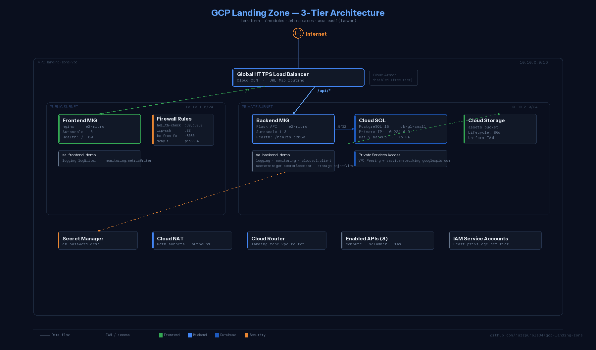

# GCP Landing Zone — 3-Tier App with Terraform

> **This deploys real GCP resources that cost real money (~$3-5/day).
> Always run `terraform destroy` when done. Set up a [budget alert](https://console.cloud.google.com/billing/budgets) first.**

Deploy a production-grade 3-tier application on Google Cloud with a single command. Built to demonstrate GCP + Terraform best practices for anyone learning Infrastructure as Code.



## What is This?

**Terraform** is Infrastructure as Code — you define your cloud resources in `.tf` files, and Terraform creates, updates, and deletes them automatically.

**A Landing Zone** is the foundational infrastructure that enterprises set up before deploying applications: networking, IAM, security policies, and monitoring. This project builds one from scratch.

This repo provisions **54 GCP resources** across 7 Terraform modules. Clone it, answer a few questions, and you have a working 3-tier app running on GCP.

## Quick Start

```bash
git clone https://github.com/jazzpujols34/gcp-landing-zone.git
cd gcp-landing-zone
./setup.sh
```

The interactive setup will:
1. Check that Terraform and gcloud are installed
2. Ask you a few questions (project ID, region, machine sizes, DB password)
3. Validate your GCP project exists and has billing
4. Generate `terraform.tfvars`
5. Run `terraform init` + `terraform plan` + `terraform apply`
6. Print the load balancer IP when done

**Total time:** ~15 minutes (Cloud SQL takes the longest to provision).

**What success looks like:** After deployment, visit `http://<LB_IP>` in your browser. You'll see a styled dashboard showing the status of all 3 tiers. The LB health checks may take 5-10 minutes to pass — if you see a 502 error, wait and refresh.

## Prerequisites

| Tool | Install |
|------|---------|
| Terraform >= 1.5 | [hashicorp.com/terraform/install](https://developer.hashicorp.com/terraform/install) or `brew install terraform` |
| gcloud CLI | [cloud.google.com/sdk/docs/install](https://cloud.google.com/sdk/docs/install) |
| GCP Project | With billing enabled ([create one](https://console.cloud.google.com/projectcreate)) |
| Permissions | Owner or Editor on the project |

```bash
# Authenticate (one-time)
gcloud auth login
gcloud auth application-default login
gcloud config set project YOUR_PROJECT_ID
```

## What Gets Deployed

| Layer | Service | Details |
|-------|---------|---------|
| Edge | Cloud CDN | Caches static content from frontend |
| Load Balancing | Global HTTPS LB | Routes `/api/*` to backend, everything else to frontend |
| Frontend | GCE + MIG | nginx dashboard, autoscaling 1-3 instances |
| Backend | GCE + MIG | Flask API, autoscaling 1-3, private subnet only |
| Database | Cloud SQL PostgreSQL 15 | Private IP only (via VPC peering), daily backups |
| Storage | Cloud Storage | Static assets bucket with lifecycle policy |
| Networking | VPC + Cloud NAT | Public/private subnets, NAT for outbound |
| Secrets | Secret Manager | DB password stored and accessed securely |
| IAM | Service Accounts | Least-privilege: separate SA per tier |
| Monitoring | Cloud Logging | Ops Agent on all instances |

**Note:** Cloud Armor (WAF) is included but commented out — free trial projects have zero quota for security policies. Uncomment when using a paid billing account.

## Configuration

### Option A: Interactive setup (recommended)

```bash
./setup.sh
```

### Option B: Manual

```bash
cp terraform.tfvars.example terraform.tfvars
# Edit terraform.tfvars with your values
terraform init
terraform plan
terraform apply
```

### Key Variables

```hcl
project_id  = "your-gcp-project-id"    # Required — your GCP project
region      = "asia-east1"              # Default: Taiwan
db_password = "your-strong-password"    # Required — stored in Secret Manager

# Cost controls
frontend_machine_type = "e2-micro"      # ~$0.008/hr
backend_machine_type  = "e2-micro"      # ~$0.008/hr
use_preemptible       = true            # 70% cheaper, may restart
db_tier               = "db-g1-small"   # ~$0.05/hr
```

## Useful Commands

```bash
terraform output                    # Show LB IP, SQL connection, bucket URL
terraform plan                      # Preview changes
terraform apply                     # Apply changes
terraform destroy                   # Tear down everything (stop billing!)

# SSH into instances (via IAP — no public IP needed)
gcloud compute ssh INSTANCE_NAME --zone=ZONE --tunnel-through-iap

# Check health
gcloud compute backend-services get-health frontend-backend-svc-demo --global
gcloud compute backend-services get-health backend-backend-svc-demo --global
```

## Cost

| Resource | Spec | Est. Cost |
|----------|------|-----------|
| GCE (2x FE + 2x BE) | e2-micro, preemptible | ~$1.20/day |
| Cloud SQL | db-g1-small, no HA | ~$1.00/day |
| Cloud LB | Forwarding rule | ~$0.60/day |
| Cloud NAT | Per gateway | ~$0.30/day |
| GCS + Secret Manager | Minimal | ~$0.01/day |
| **Total** | | **~$3.10/day** |

### Forgot to Destroy?

If you're worried about orphaned resources:
1. Check [Billing > Reports](https://console.cloud.google.com/billing) filtered by your project
2. Run these to verify nothing is running:
   ```bash
   gcloud compute instances list --project=YOUR_PROJECT
   gcloud sql instances list --project=YOUR_PROJECT
   gcloud compute forwarding-rules list --project=YOUR_PROJECT
   ```
3. If all return empty, you're paying $0.

**Note:** Cloud SQL takes ~5 minutes to delete. `terraform destroy` will seem stuck — it's not. Just wait.

## Documentation

- **[Architecture Decisions](docs/architecture.md)** — Why things are built the way they are
- **[Troubleshooting](docs/troubleshooting.md)** — Real gotchas we hit (with fixes)
- **[SPEC.md](SPEC.md)** — Full project specification

## Module Structure

```
modules/
  network/        VPC, subnets, firewall, Cloud NAT, Private Services Access
  iam/            Service accounts + least-privilege role bindings
  compute/        Instance templates, MIGs, health checks, autoscalers
  database/       Cloud SQL PostgreSQL, private IP, automated backup
  storage/        GCS bucket + IAM bindings
  secrets/        Secret Manager + access bindings
  load-balancer/  Global LB, Cloud CDN, URL map, Cloud Armor (disabled)
```

## Enterprise Patterns Demonstrated

This project intentionally implements patterns that interviewers and enterprise teams look for:

1. **Network isolation** — Public/private subnet separation
2. **Private Services Access** — Cloud SQL via VPC peering (not just "private IP")
3. **Least-privilege IAM** — Dedicated service account per tier
4. **Secrets management** — DB password in Secret Manager, not env vars
5. **Defense in depth** — Firewall rules restrict inter-tier traffic
6. **Outbound control** — Cloud NAT for instances without public IPs
7. **Observability** — Health checks, Cloud Logging
8. **Cost control** — Preemptible instances, autoscaling, small tiers
9. **Org policy awareness** — Documented in architecture.md (requires org node)
10. **Workload Identity awareness** — Noted as production upgrade path

## License

MIT — see [LICENSE](LICENSE)
